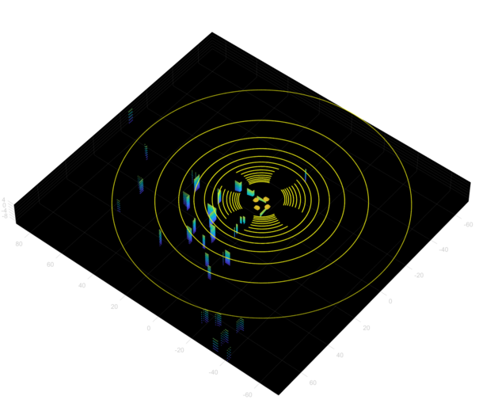
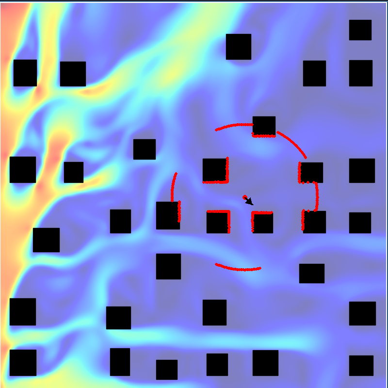

# Synthetic Data Generation

Contains the code for generating data required for the PredictingLocalWindFields in 3D project. 

Generates the following data:

- 2D Cityscapes
- Drone positions
- 2D LiDAR scan
- 2D Windflow data
- 3D Wind flow field using Phiflow
- 3D Cityscape using quadtrees for intersection (csv and mat files)
- PointCloud Data from a simulated LiDAR on a UAV using the MATLAB UAB ToolBox

## Usage

Install the required packages using the following command:

```bash
pip install -r requirements.txt
```

Run the following command to generate the cityscapes:

```bash
python main.py gen cityscapes
```

Run the following command to generate drone positions:

```bash
python main.py gen drone
```

Run the following command to generate wind flow fields:

```bash
python main.py gen windflow
```

Run the following command to save visualisations of the wind flow fields:

```bash
python main.py viz wind --index 10 --export-all
```

Run the following command to generate 2D LiDAR scans:

```bash
python main.py gen lidar
```

Run the following command to generate demo viz cityscapes:

```bash
python main.py viz wind --index 10 --export-all --export-dir data/demoviz --map_size 140
```

Run the following command to generate transparent cityscapes:

```bash
python main.py viz wind --index 10 --export-all-transparent --map_size 140 --export-dir data/transparent
```

To the run the interactive demo :video_game:

```bash
python main.py demo --index 0
```

The MATLAB files present in this repo must be run from the MATLAB editor application.

## Notes

The 3D LiDAR simulation is conducted using the MATLAB UAV toolbox. MATLAB requires 4 corners of a rect to create a mesh. The CSV file contains the start and end coordinates for a rect. The .mat files contain the 4 corners of the rect.

### Example PointCloud from Cityscape



### Example Wind Flow Field with LiDAR Scans



### Output File Structure

```txt
data/
├─ cityscapes/
│  ├─ city_0.csv
│  ├─ city_1.csv
│  ├─ city_(...).csv
│  ├─ city_60.csv
├─ drone_positions/
│  ├─ city_0.csv
│  ├─ city_1.csv
│  ├─ city_(...).csv
│  ├─ city_60.csv
├─ exportviz/
│  ├─ city_0.png
│  ├─ city_1.png
│  ├─ city_(...).png
│  ├─ city_60.png
├─ matlab_meshes/
│  ├─ city_0.mat
│  ├─ city_1.mat
│  ├─ city_(...).mat
│  ├─ city_60.mat
├─ lidar/
│  ├─ city_0_pos0.npy
│  ├─ city_0_pos1.npy
│  ├─ city_0_pos(...).npy
│  ├─ city_1_pos0.npy
│  ├─ city_1_pos1.npy
│  ├─ city_1_pos(...).npy
│  ├─ city_(...)_pos(...).npy
├─ windflow/
│  ├─ city_0.npy
│  ├─ city_1.npy
│  ├─ city_(...).npy
│  ├─ city_60.npy
├─ pointclouds/
│  ├─ city_0/
│  │  ├─ pointcloud_1.csv
│  │  ├─ pointcloud_(...).csv
│  │  ├─ pointcloud_10.csv
│  ├─ city_1/
│  │  ├─ pointcloud_1.csv
│  │  ├─ pointcloud_(...).csv
│  │  ├─ pointcloud_10.csv
│  ├─ city_60/
│  │  ├─ pointcloud_1.csv
│  │  ├─ pointcloud_(...).csv
│  │  ├─ pointcloud_10.csv
```

## MATLAB Toolbox requirements

- UAV Toolbox
- Aerospace Blockset
- Aerospace Toolbox
- Control System Toolbox
- Navigation Toolbox
- Stateflow
- Simulink
- Simulink 3D Animation
